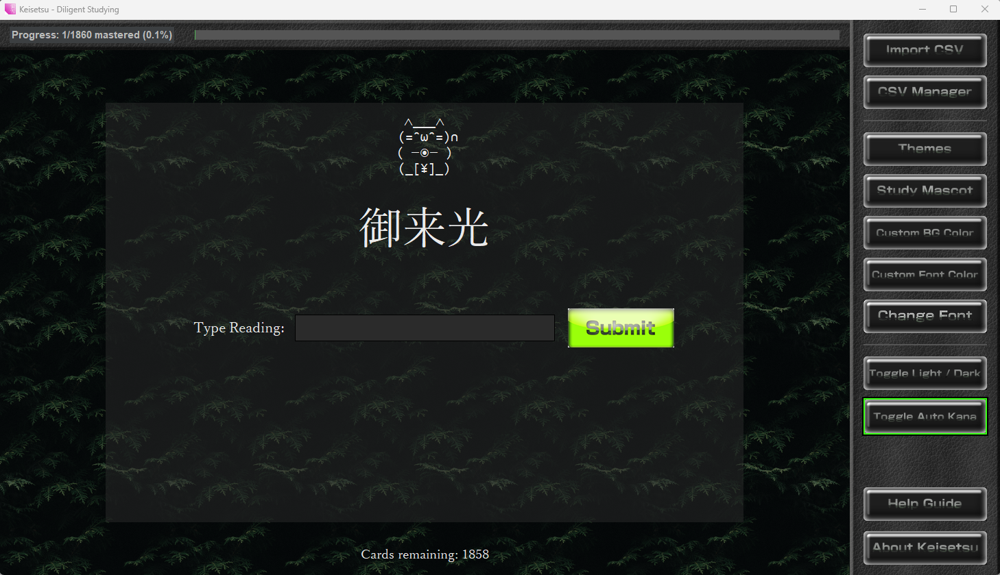

# Keisetsu

A flashcard app for studying Japanese and Chinese vocabulary from your own decks.



- **Japanese:** type romaji and it turns into kana as you type (`taberu` → たべる).
- **Chinese:** type numbered pinyin and it turns into tone marks (`ni3hao3` → nǐhǎo).
- Cards you miss come back later in the deck until you get them right.
- A Study Mascot keeps you company. Pick from ten, from Shiba Inu to Sun Wukong.
- Bright and Dark mode, custom fonts and colors, and image themes.
- A built-in **CSV Manager** for making and editing your own decks, including a rapid-entry mode for typing a whole list from a textbook.

## Download and run

### Windows

1. Go to the [latest release](../../releases/latest) and download **Keisetsu-Windows.zip**.
2. Unzip it anywhere, for example to your Desktop or Documents.
3. Open the `Keisetsu` folder and double-click **Keisetsu.exe**.

You don't need to install Python.

Windows may say "Windows protected your PC" the first time, because the app isn't code-signed (signing costs money). Click **More info**, then **Run anyway**.

Keep `Keisetsu.exe` in its folder with the files next to it. To put it on your Desktop, right-click `Keisetsu.exe` and choose **Show more options → Send to → Desktop (create shortcut)**.

### Linux

You need Python 3 with Tkinter. Download this repository (the green **Code** button → **Download ZIP**), unzip it, and in that folder run:

```
pip install -r requirements.txt
python3 keisetsu.py
```

On Debian, Ubuntu and Linux Mint you may need `sudo apt install python3-tk python3-pandas python3-pil python3-pil.imagetk` instead of `pip`.

To add Keisetsu to your app menu (so you can pin it to the panel), run `./install_launcher.sh`.

### macOS

Install Python 3 from [python.org](https://www.python.org/downloads/), then follow the Linux steps above. You can skip the launcher script.

## Getting started

1. Click **Import CSV** and choose **"Select this deck to test the program!"**. It walks you through answering a card.
2. Click **CSV Manager** to start making your own decks. They're saved in the `vocab_lists` folder.
3. The **Help Guide** button explains everything else.

## Decks

A deck is a CSV file with these columns:

| Question | Answers | Comment | Instructions |
|---|---|---|---|
| 食べる | taberu | to eat | Type the reading! |

Separate several accepted answers with commas. The CSV Manager handles this for you, so you never need to edit the files by hand.

## Themes

A theme is a folder in `themes/` with `bg_main.png`, `bg_sidebar.png`, `bg_topbar.png` and `btn_*.png` button images. The included `mb` theme shows how it's put together. Choose themes with the **Themes** button.

## Building the Windows version yourself

On Windows, with Python and `pip install -r requirements.txt pyinstaller`, run:

```
python build_windows.py
```

The result is in `dist/`.

##Planned features for the future

- Ability to create image based decks
- Ability to embed audio files in deck creation to create listening based decks (eg. type what you hear, etc.)
- .zip file importation to accommodate for visual/audio based tests (folder structure for text questions/audio questions)
- Stroke order based decks
- Various game modes

## License

[MIT](LICENSE)
